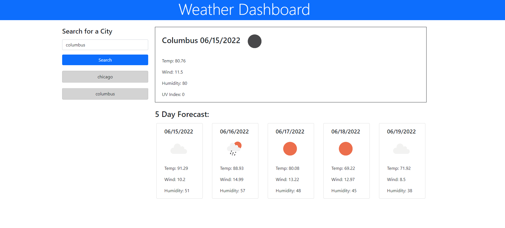

# weather-app

## Description

This project used javascript and bootstrap for UI design and function, while server side APIs from OpenWeather API handle data requests for output to the deployed application for basic city weather info.

Link to deplayed application: https://marquiswillis.github.io/weather-app/

## Usage

- When the user types in a city in the form and submits, a weather dashboard will be will display current data and a 5 day forecast 
- The input value will be added to a list below the search button

